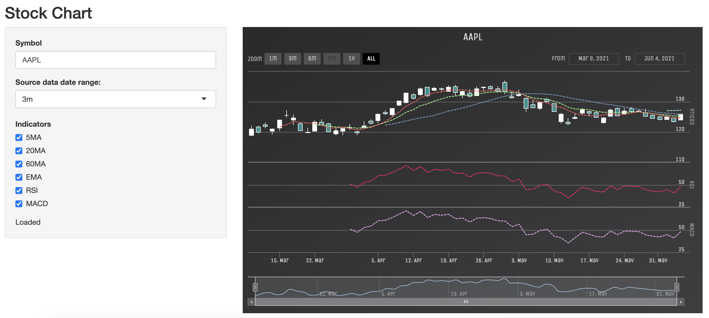
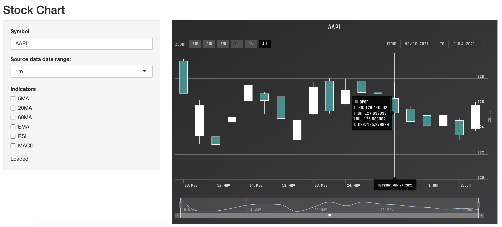
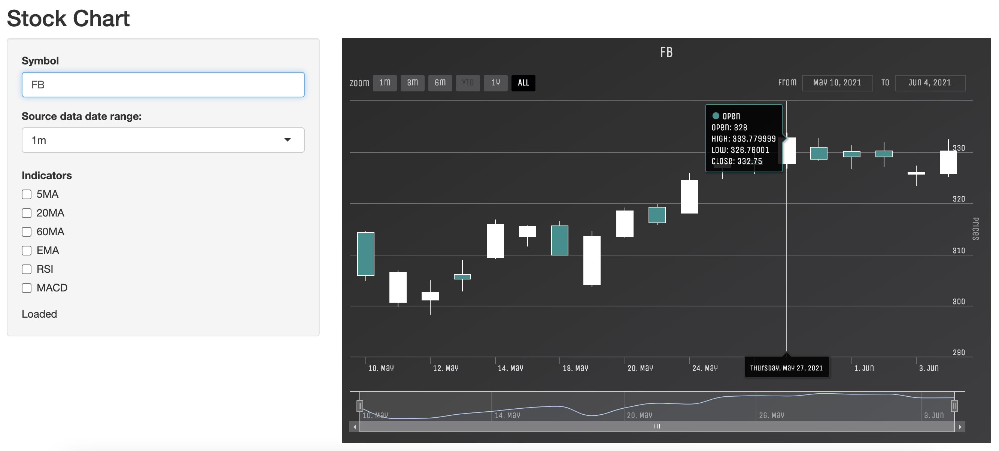
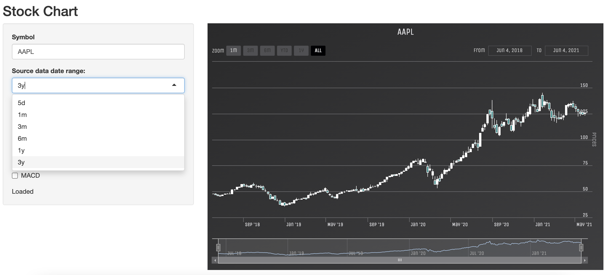
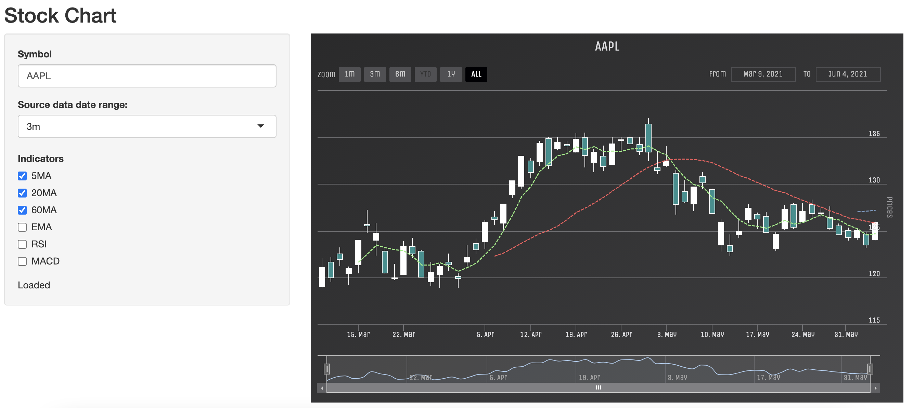
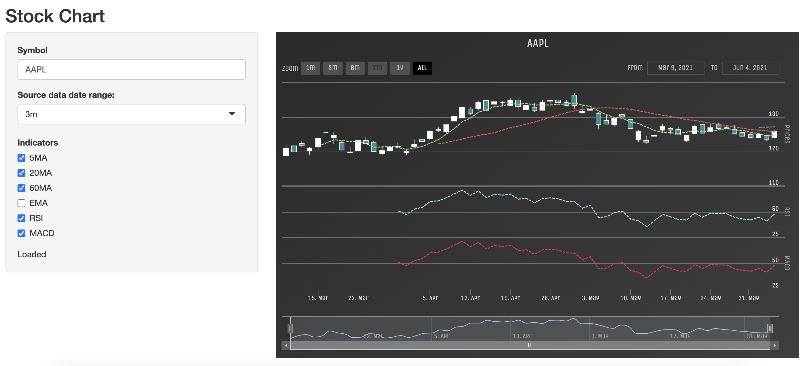

```{r setup, include=FALSE}
knitr::opts_chunk$set(echo = FALSE)
```

## Introduction

StockChart is a *Shiny* application built on *quantmod* for quantitative financial analysis and *highcharter* for visualization.

{width=80%}
[Stock Chart](https://chiahsun.shinyapps.io/ShinyDemo/)

## Symbols

Enter the *stock symbol*(e.g. AAPL, FB) in the *Symbol* text input.

{width=60%}

{width=60%}


## Date Range

Choose the date range(e.g. 5d, 1m, 3m, etc) in the *Source data date range* selection list.


{width=80%}

## Indicators

Toggle your favorite indicators. (e.g. 5MA, MACD, etc)

{width=60%}
{width=60%}

